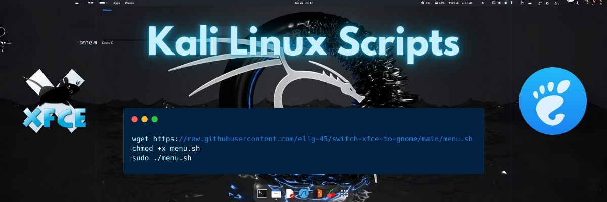

# 🚀 Kali Linux Scripts | Scripts pour Kali Linux

[](https://github.com/elig-45/switch-xfce-to-gnome/stargazers)
[](https://github.com/elig-45/switch-xfce-to-gnome/network/members)
[](https://github.com/elig-45/switch-xfce-to-gnome/blob/main/LICENSE)
[](https://www.kali.org/)

---

## 🌍 Description

### 🇫🇷 Français

Ce dépôt contient plusieurs scripts utiles pour **Kali Linux**, y compris des scripts pour basculer de **XFCE à GNOME** et pour **configurer Kali Linux en français**. Le script principal `menu.sh` permet de choisir et d'exécuter ces scripts facilement.

### 🇬🇧 English

This repository contains several useful scripts for **Kali Linux**, including scripts to switch from **XFCE to GNOME** and to **configure Kali Linux in French**. The main script `menu.sh` allows you to choose and run these scripts easily.

---

## 📥 Installation & Usage

### Utilisation du menu principal

```bash
wget https://raw.githubusercontent.com/elig-45/switch-xfce-to-gnome/main/menu.sh
chmod +x menu.sh
sudo ./menu.sh
```

---

## 🛠 Fonctionnalités | Features

### 🇫🇷 Français
✅ **Switch XFCE to GNOME** : Installe **GNOME** proprement, détecte automatiquement l'environnement **VirtualBox, VMware, KVM** et installe les outils nécessaires, désactive la touche **Super (Windows)** pour **ouvrir directement le menu des applications**, offre une **option de mise à jour complète avant redémarrage**, permet la **désinstallation de XFCE si l'utilisateur le souhaite**, et **optimise le stockage et nettoie les anciennes dépendances XFCE**.  
✅ **Configure Kali Linux in French** : Configure Kali Linux entièrement en français, installe les paquets de langue française, configure les locales et le clavier en français, définit le fuseau horaire à **Europe/Paris**, et désinstalle la langue anglaise.

### 🇬🇧 English
✅ **Switch XFCE to GNOME** : Installs **GNOME** properly, automatically detects **VirtualBox, VMware, KVM** environments and installs required tools, disables the **Super (Windows) key** to **directly open the application menu**, provides an **option for full system update before reboot**, allows **XFCE removal if desired**, and **optimizes storage and cleans up old XFCE dependencies**.  
✅ **Configure Kali Linux in French** : Configures Kali Linux entirely in French, installs French language packages, configures locales and keyboard to French, sets the timezone to **Europe/Paris**, and uninstalls the English language.

---

## ❓ Dépannage | Troubleshooting

### 🌑 🇫🇷 Écran noir après connexion ?  
```bash
sudo dpkg-reconfigure gdm3
sudo reboot
```

Si le problème persiste, essayez ceci :
```bash
sudo apt install -y kali-desktop-gnome
sudo update-alternatives --set x-session-manager /usr/bin/gnome-session
sudo reboot
```

### 🌑 🇬🇧 Black screen after login?  
```bash
sudo dpkg-reconfigure gdm3
sudo reboot
```

If the issue persists, try:
```bash
sudo apt install -y kali-desktop-gnome
sudo update-alternatives --set x-session-manager /usr/bin/gnome-session
sudo reboot
```

### 🔄 🇫🇷 Restaurer XFCE  🇬🇧 Restore XFCE  
```bash
sudo apt install -y kali-desktop-xfce
```

---

## 📜 Licence | License

### 🇫🇷 Français
Ce projet est sous licence **MIT**.

### 🇬🇧 English
This project is licensed under **MIT**.

---

## 📢 Contribuer | Contribute

### 🇫🇷 Français
💡 **Toute contribution est la bienvenue !**  
Forkez le dépôt, proposez des **pull requests**, ou ouvrez une **issue** pour signaler un problème.

### 🇬🇧 English
💡 **Contributions are welcome!**  
Fork the repository, submit **pull requests**, or open an **issue** to report any problem.

---

## 🔗 Liens utiles | Useful Links

- 🌐 [Site officiel de GNOME](https://www.gnome.org/)
- 📜 [Documentation Kali Linux](https://www.kali.org/docs/)
